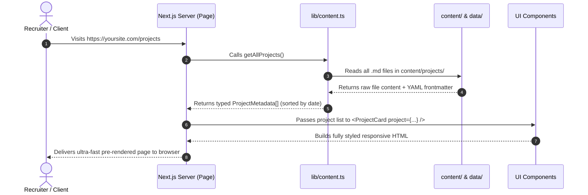

# 🚀 Developer Portfolio — Architecture & Maintenance Guide

Welcome to the architectural and developer maintenance manual for your professional software developer portfolio website.

This guide explains **how the system works**, **what each file and component does**, the **complete visual architecture**, and **exact step-by-step instructions on how to update content yourself** without breaking any layout or styling code.

---

## 1. Visual System Architecture

```mermaid
graph TD
    subgraph Client["🖥️ User Browser"]
        A["Browser Window / Mobile / Tablet"]
    end

    subgraph AppRouter["⚡ Next.js 14 App Router (app/)"]
        Layout["Root Layout (layout.tsx) + Inter Font"]
        Home["Home Page (page.tsx)"]
        ProjectsList["Projects Page (projects/page.tsx)"]
        ProjectDetail["Case Study (projects/[slug]/page.tsx)"]
        BlogList["Blog Index (blog/page.tsx)"]
        BlogDetail["Article View (blog/[slug]/page.tsx)"]
        ContactPage["Contact View (contact/page.tsx)"]
        ContactAPI["API Route (api/contact/route.ts)"]
    end

    subgraph Components["🧩 Component Hierarchy"]
        Nav["Navbar (Navbar.tsx)"]
        Foot["Footer (Footer.tsx)"]
        HeroSec["Hero Section (Hero.tsx)"]
        AboutSec["About Section (About.tsx)"]
        SkillsSec["Skills Grid (SkillsGrid.tsx)"]
        ProjectCardSec["Project Cards (ProjectCard.tsx)"]
        ContactFormSec["Contact Form (ContactForm.tsx)"]
        UIPrimitives["UI: Button, Badge, SectionHeading"]
    end

    subgraph ContentLayer["📁 Decoupled Content Layer"]
        SkillsData["data/skills.ts (Typed TS Array)"]
        ProjectsMD["content/projects/*.md (Markdown + YAML Frontmatter)"]
        BlogMD["content/blog/*.md (Markdown + YAML Frontmatter)"]
        Parser["lib/content.ts (gray-matter + remark)"]
        SEOHelper["lib/seo.ts (Metadata generator)"]
    end

    subgraph StaticAssets["📦 Public Assets (public/)"]
        Resume["resume.pdf"]
        Thumbnails["images/projects/*.svg"]
        Favicon["favicon.svg & app/icon.svg"]
    end

    %% Connections
    A <--> Layout
    Layout --> Nav
    Layout --> Foot
    Layout --> Home
    Layout --> ProjectsList
    Layout --> ProjectDetail
    Layout --> BlogList
    Layout --> BlogDetail
    Layout --> ContactPage

    Home --> HeroSec
    Home --> AboutSec
    Home --> SkillsSec
    Home --> ProjectCardSec
    Home --> UIPrimitives

    SkillsSec -. reads .-> SkillsData
    Home -. reads .-> Parser
    ProjectsList -. reads .-> Parser
    ProjectDetail -. reads .-> Parser
    BlogList -. reads .-> Parser
    BlogDetail -. reads .-> Parser

    Parser -. parses .-> ProjectsMD
    Parser -. parses .-> BlogMD

    ContactPage --> ContactFormSec
    ContactFormSec -- "POST JSON" --> ContactAPI
    ContactAPI -. "Stub logs (or Resend/Formspree)" .-> Client

    Nav -. download link .-> Resume
    ProjectCardSec -. preview .-> Thumbnails
```



---

## 2. Core Technologies Used & Why

| Technology | Why It Was Chosen | Benefit to You |
|---|---|---|
| **Next.js 14+ (App Router)** | Industry gold standard for React web applications. Generates pre-rendered static HTML with dynamic capabilities. | Incredible speed, zero layout shift, instant page loads, and top SEO score. |
| **TypeScript** | Strict static type-checking. | Catches mistakes before you deploy; guarantees data schemas for projects, skills, and blog posts. |
| **Tailwind CSS** | Utility-first styling engine with customized corporate design tokens. | Easy to adjust colors, spacing, and typography without writing custom CSS files. |
| **Markdown + gray-matter** | Headless content management. | Add projects and blog posts just by creating text files; no database or external CMS required. |
| **Lucide React** | Lightweight, modern SVG icon library. | Crisp, retina-ready corporate icons with zero bundle bloat. |
| **Next/Font (Google Inter)** | Self-hosted Google Inter font automatically optimized by Next.js. | Eliminates external font requests, guarantees privacy compliance, and prevents font flicker. |

---

## 3. Who is Responsible for What? (Folder Structure)

```
MyPortfolio/
├── app/                          # NEXT.JS APP ROUTER (Pages & Routes)
│   ├── layout.tsx                # Base shell: contains HTML, Head, Inter Font, Navbar, Footer
│   ├── page.tsx                  # Home Page: assembles Hero, About, Skills, Highlights
│   ├── globals.css               # Global CSS, Tailwind base directives, typography rules
│   ├── icon.svg                  # Modern SVG favicon served automatically by Next.js
│   ├── robots.ts                 # SEO search crawler instructions (robots.txt)
│   ├── sitemap.ts                # Dynamic sitemap.xml listing all routes & markdown slugs
│   ├── projects/
│   │   ├── page.tsx              # All projects grid page with tech filters
│   │   └── [slug]/page.tsx       # Dynamic project case study reader
│   ├── blog/
│   │   ├── page.tsx              # Blog index page
│   │   └── [slug]/page.tsx       # Dynamic Markdown blog article renderer
│   ├── contact/
│   │   └── page.tsx              # Contact page (info + contact form)
│   └── api/
│       └── contact/route.ts      # Serverless API endpoint handling form submissions
│
├── components/                   # REUSABLE REACT UI MODULES
│   ├── layout/
│   │   ├── Navbar.tsx            # Sticky header, navigation links, mobile menu, "Download Resume"
│   │   └── Footer.tsx            # Copyright, social channels (GitHub, LinkedIn, Email), quick links
│   ├── sections/
│   │   ├── Hero.tsx              # Eye-catching intro, credentials, interactive terminal card
│   │   ├── About.tsx             # Professional narrative, 3 engineering pillars
│   │   ├── SkillsGrid.tsx        # Categorized skill badges with proficiency tags
│   │   ├── ProjectCard.tsx       # Card with thumbnail, tags, links, and case study button
│   │   └── ContactForm.tsx       # Interactive form with real-time validation & status messages
│   └── ui/
│       ├── Button.tsx            # Standardized button (primary, outline, ghost, link modes)
│       ├── Badge.tsx             # Tech chip badge with subtle borders
│       └── SectionHeading.tsx    # Standardized section title with animated pulse eyebrow
│
├── content/                      # YOUR WRITTEN CONTENT (EDIT FREELY)
│   ├── projects/                 # One .md file per project (e.g. enterprise-analytics-platform.md)
│   └── blog/                     # One .md file per article (e.g. clean-architecture-in-typescript.md)
│
├── data/
│   └── skills.ts                 # Structured skills list categorized by domain
│
├── lib/
│   ├── content.ts                # Parser reading .md files, extracting frontmatter, calculating reading times
│   └── seo.ts                    # Central site metadata configuration (names, URLs, social links)
│
└── public/                       # RAW STATIC ASSETS
    ├── resume.pdf                # Your downloadable CV/Resume
    ├── favicon.svg               # SVG Favicon fallback
    └── images/
        └── projects/             # SVG/PNG thumbnails for project cards
```

---

## 4. How Data Flows (Lifecycle of a Page Visit)

Here is what happens when someone visits your website:



---

## 5. How to Update Things Yourself (Step-by-Step)

### A. How to Update Your Personal Info & Links
Open [`lib/seo.ts`](file:///c:/Users/Adqura1/OneDrive%20-%20Adqura/Desktop/MyPortfolio/lib/seo.ts):
```typescript
export const siteConfig = {
  name: "Your Name | Senior Software Engineer",
  shortName: "Your Name",
  title: "Your Name — Senior Full-Stack & Systems Developer",
  description: "Your customized professional bio...",
  url: "https://your-portfolio.vercel.app",
  author: "Your Name",
  links: {
    github: "https://github.com/yourusername",
    linkedin: "https://linkedin.com/in/yourusername",
    email: "mailto:your.email@example.com",
    twitter: "https://twitter.com/yourhandle",
  },
};
```
*All pages, meta tags, and footer links will automatically update.*

---

### B. How to Add or Edit a Skill
Open [`data/skills.ts`](file:///c:/Users/Adqura1/OneDrive%20-%20Adqura/Desktop/MyPortfolio/data/skills.ts):
Locate the desired category (`Languages`, `Frameworks & Libraries`, `Databases & Storage`, `DevOps & Cloud`, or `Architecture & Tools`), and add an item:
```typescript
{
  category: "Languages",
  skills: [
    { name: "Rust", proficiency: "Familiar" }, // <-- Just add your new skill here!
    { name: "TypeScript", proficiency: "Advanced" },
    ...
  ],
}
```

---

### C. How to Add a New Project
Create a new file in [`content/projects/`](file:///c:/Users/Adqura1/OneDrive%20-%20Adqura/Desktop/MyPortfolio/content/projects/), for example: `my-awesome-app.md`.

Fill it with this structure:
```markdown
---
title: "AI Automation Workflow Engine"
slug: "ai-automation-workflow-engine"
description: "A distributed microservice pipeline that automates document processing using LLMs."
techTags: ["Next.js", "Python", "FastAPI", "Docker", "PostgreSQL"]
thumbnail: "/images/projects/portfolio.svg"
liveUrl: "https://my-app-demo.com"
repoUrl: "https://github.com/myuser/ai-engine"
featured: true
date: "2024-05-01"
clientOrCompany: "Enterprise Client Corp"
role: "Lead Architect"
---

## Project Overview
Write your case study here in normal Markdown!

### Highlights & Impact
- Built high-performance async queuing system.
- Decreased document parsing time by 80%.

### Technical Stack
You can write code blocks easily:
```typescript
const result = await processDocument(payload);
```
```
*That’s it! The home page, the `/projects` gallery, the sitemap, and the `/projects/ai-automation-workflow-engine` case study page will immediately update.*

---

### D. How to Add a New Blog Post
Create a new file in [`content/blog/`](file:///c:/Users/Adqura1/OneDrive%20-%20Adqura/Desktop/MyPortfolio/content/blog/), for example: `mastering-docker-builds.md`.

```markdown
---
title: "Mastering Multi-Stage Docker Builds for Production"
slug: "mastering-docker-builds"
excerpt: "How to shrink your Docker images from 1.2GB down to 85MB using multi-stage builds and Alpine layers."
date: "2024-06-15"
tags: ["Docker", "DevOps", "Performance"]
author: "Your Name"
---

Your blog post content goes here in normal markdown!

## 1. Why Image Size Matters
Write your insights here...
```
*Next.js will automatically calculate the reading time, generate the slug, format the article typography, and list it on `/blog`.*

---

### E. How to Update Your Resume PDF
Simply copy your updated resume PDF file to:
[`public/resume.pdf`](file:///c:/Users/Adqura1/OneDrive%20-%20Adqura/Desktop/MyPortfolio/public/resume.pdf) (keep the name `resume.pdf`).
All "Download Resume" buttons on the Navbar, Hero section, and Footer will immediately serve the new file.

---

### F. How to Connect Real Emails to the Contact Form

Right now, [`app/api/contact/route.ts`](file:///c:/Users/Adqura1/OneDrive%20-%20Adqura/Desktop/MyPortfolio/app/api/contact/route.ts) validates inputs and logs the submission cleanly to the server terminal.

To have messages delivered directly to your personal email inbox, you have two options:

#### Option 1: Resend (Free & Recommended for Next.js)
1. Sign up for free at [resend.com](https://resend.com) and get an API Key.
2. In terminal, run:
   ```bash
   npm install resend
   ```
3. In [`app/api/contact/route.ts`](file:///c:/Users/Adqura1/OneDrive%20-%20Adqura/Desktop/MyPortfolio/app/api/contact/route.ts), uncomment the Resend block:
   ```typescript
   import { Resend } from 'resend';
   const resend = new Resend(process.env.RESEND_API_KEY);

   await resend.emails.send({
     from: 'Portfolio Contact <onboarding@resend.dev>',
     to: 'your-personal-email@gmail.com',
     reply_to: email,
     subject: `[Portfolio Inquiry] ${subject} from ${name}`,
     text: `Name: ${name}\nEmail: ${email}\n\nMessage:\n${message}`,
   });
   ```
4. Add `RESEND_API_KEY=re_your_key_here` to a `.env.local` file.

#### Option 2: Formspree (Zero code needed)
1. Sign up at [formspree.io](https://formspree.io) and create a form.
2. In [`components/sections/ContactForm.tsx`](file:///c:/Users/Adqura1/OneDrive%20-%20Adqura/Desktop/MyPortfolio/components/sections/ContactForm.tsx), change line 80:
   ```typescript
   // from:
   const res = await fetch("/api/contact", { ... });
   // to:
   const res = await fetch("https://formspree.io/f/YOUR_FORM_ID", { ... });
   ```

---

### G. How to Customize Theme Colors
Open [`tailwind.config.ts`](file:///c:/Users/Adqura1/OneDrive%20-%20Adqura/Desktop/MyPortfolio/tailwind.config.ts):
```typescript
colors: {
  corporate: {
    900: "#0f172a", // Primary dark tone (Navy/Charcoal)
    ...
  },
  accent: {
    600: "#2563eb", // Brand Accent Blue (buttons, links, active states)
    ...
  }
}
```
Change `#2563eb` to any color you like (e.g. Emerald `#059669`, Violet `#7c3aed`, or Amber `#d97706`) and the entire website’s accent color changes uniformly!

---

## 6. Development & Deployment Commands

Run these in PowerShell or your terminal from the `MyPortfolio` directory:

| Command | Action |
|---|---|
| `$env:PATH = "$env:LOCALAPPDATA\Programs\node\node-v20.18.0-win-x64;$env:PATH"; npm run dev` | Starts local dev server at `http://localhost:3000` with hot reloading. |
| `npm run build` | Compiles the production build, checks types, and pre-renders static HTML. |
| `npm run start` | Runs the production-optimized server locally. |
| `npm run lint` | Runs ESLint to verify code quality. |

---

## 7. Deploying to Vercel or Netlify (Zero Config)

Because this site is built with standard Next.js 14:
1. Push your folder to a private or public GitHub repository:
   ```bash
   git init
   git add .
   git commit -m "Initial portfolio release"
   git branch -M main
   git remote add origin https://github.com/your-username/my-portfolio.git
   git push -u origin main
   ```
2. Go to **[vercel.com](https://vercel.com)** -> "Add New Project" -> Import your GitHub repository.
3. Click **Deploy**. Vercel detects Next.js automatically and gives you a live global URL with free SSL and custom domain support in under 60 seconds!
