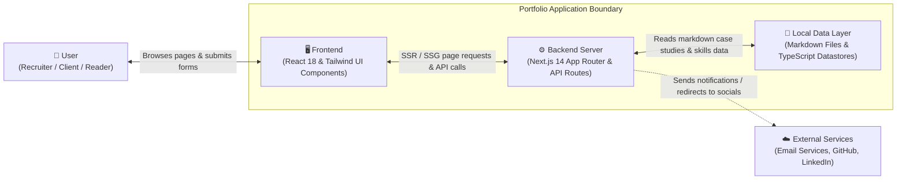

# 01 — Executive Overview

## 1. What This Project Does (In Plain Language)

This project is a high-speed, professional website built to showcase a senior software engineer's professional portfolio, past technical achievements, engineering case studies, and technical articles. It acts as an interactive digital resume and consulting storefront where prospective clients, recruiters, and engineering leaders can explore detailed case studies, inspect technical proficiencies, read in-depth architectural guides, and submit direct business or hiring inquiries.

Unlike traditional portfolio websites that require a recurring database subscription or third-party content management system (CMS) like WordPress or Contentful, this system is built entirely around **static pre-rendering** and **decoupled file-based content**. All articles, projects, and skills are written in plain Markdown files and TypeScript data objects stored directly inside the code repository. Whenever the site is deployed, Next.js converts those files into ultra-fast, pre-rendered web pages that load instantly for any visitor anywhere in the world.

---

## 2. Who Uses It and What Problem It Solves

### Target Users

1. **Prospective Employers & Hiring Managers**: Reviewing real-world production projects, engineering leadership experience, system design decisions, and verifiable code quality.
2. **Consulting Clients & Enterprise Partners**: Assessing architectural consulting capabilities, technical depth, and reaching out with project scopes or requests for proposals (RFPs).
3. **Engineering Peers & Readers**: Reading technical deep-dives on TypeScript, Clean Architecture, and scalable systems, and reviewing open-source code repositories.
4. **The Portfolio Owner (Alex Morgan / Danish Parveez)**: Maintaining full ownership and version control over personal branding, articles, projects, and resume downloads without ongoing SaaS maintenance fees or vendor lock-in.

### Problems It Solves

| Problem with Traditional Portfolios | How This Project Solves It |
|---|---|
| **Slow Load Times & Poor SEO**: Bloated site builders (Wix, WordPress) load excessive tracking scripts, causing slow initial page loads and poor search rankings. | Built on **Next.js 14 App Router** with automatic server-side static rendering, producing clean, semantic HTML and instant load times with near-perfect SEO scores. |
| **High Maintenance Costs**: Databases and headless CMS platforms incur monthly subscription fees and risk unexpected downtime. | Uses a **zero-database, file-based architecture**. Content is stored in standard Markdown (`.md`) files inside the repository, costing zero dollars for database hosting. |
| **Brittle Formatting & Layout Drift**: Non-technical CMS editors often break responsive design layouts when adding new projects. | Enforces strict **TypeScript data interfaces** (`ProjectMetadata`, `BlogPostMetadata`). If a required field is missing, the build tool catches it before publication. |
| **Spam & Vulnerabilities**: Traditional contact forms and CMS plugins are targets for SQL injection, cross-site scripting (XSS), and spam bots. | Incorporates server-side schema validation and email formatting checks via Next.js Route Handlers (`app/api/contact/route.ts`), completely isolated from client scripts. |

---

## 3. High-Level System Architecture Diagram

Below is the 10,000-foot view of how the system operates. It captures the boundary relationships between the user, the web frontend, the backend application server, the local file-based data layer, and external services.

### Component Roles at a Glance

- **User**: Interacts with the portfolio via any desktop, tablet, or mobile browser.
- **Frontend**: Renders responsive, accessible UI pages (Home, Projects, Blog, Contact, Case Studies) with interactive client components for menus, filters, and form validation.
- **Backend Server**: Pre-renders static HTML pages at build time, serves dynamic case studies on-demand, and processes form submissions through secure serverless HTTP endpoints.
- **Local Data Layer**: The authoritative storage repository for all written content, containing structured Markdown documents (`content/projects/`, `content/blog/`) and typed arrays (`data/skills.ts`).
- **External Services**: Third-party destinations connected via links (GitHub, LinkedIn) or serverless email dispatch adapters (Resend / Formspree / SendGrid integration hooks).
