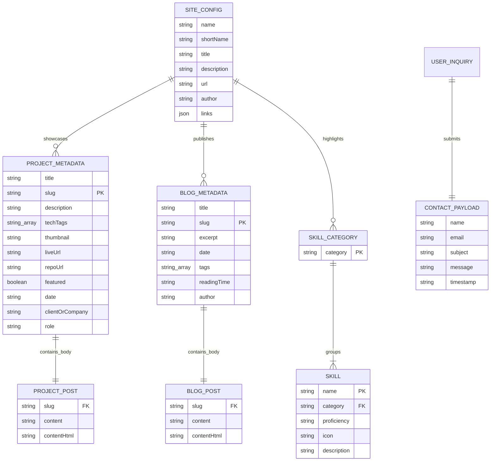

# 04 — Data Layer & Type System

## 1. Data Layer Overview

This application does not connect to a relational database (such as PostgreSQL or MySQL) or a document store (such as MongoDB). Instead, it implements a **file-based headless content model**. In this paradigm:
1. Long-form content and case studies are stored as plain Markdown (`.md`) documents with YAML frontmatter headers inside [`content/projects/`](file:///c:/Users/Adqura1/OneDrive%20-%20Adqura/Desktop/MyPortfolio/content/projects) and [`content/blog/`](file:///c:/Users/Adqura1/OneDrive%20-%20Adqura/Desktop/MyPortfolio/content/blog).
2. Categorized technical skills are maintained in a typed TypeScript in-memory datastore inside [`data/skills.ts`](file:///c:/Users/Adqura1/OneDrive%20-%20Adqura/Desktop/MyPortfolio/data/skills.ts).
3. Contact inquiries are validated and handled transiently via HTTP request payloads processed by [`app/api/contact/route.ts`](file:///c:/Users/Adqura1/OneDrive%20-%20Adqura/Desktop/MyPortfolio/app/api/contact/route.ts).

All models are strictly typed using TypeScript interfaces, ensuring compile-time verification across content queries, page routes, and UI components.

---

## 2. Entity Relationship Model

Although no SQL database is present, the domain entities maintain strict structural relationships. The following Mermaid Entity-Relationship (ER) diagram models the conceptual entities, their attributes, and their relationships:



---

## 3. Data Models, Types, and Interfaces

### A. Projects Schema (`lib/content.ts`)

```typescript
// From lib/content.ts (lines 7-19)
export interface ProjectMetadata {
  title: string;
  slug: string;
  description: string;
  techTags: string[];
  thumbnail: string;
  liveUrl?: string;
  repoUrl?: string;
  featured: boolean;
  date: string;
  clientOrCompany?: string;
  role?: string;
}

// From lib/content.ts (lines 21-25)
export interface ProjectPost {
  metadata: ProjectMetadata;
  content: string;
  contentHtml: string;
}
```

#### Field Specifications & Constraints

| Field | Type | Required? | Description & Fallback Constraints |
|---|---|---|---|
| `title` | `string` | Yes | Human-readable title. Defaults to `"Untitled Project"` if missing in frontmatter. |
| `slug` | `string` | Yes | URL identifier. If omitted from frontmatter, defaults to the Markdown filename without `.md`. |
| `description` | `string` | Yes | 1-2 sentence overview displayed on project cards and meta descriptions. Defaults to `""`. |
| `techTags` | `string[]` | Yes | Array of technology names (e.g. `["Next.js", "TypeScript", "PostgreSQL"]`). Defaults to `[]`. |
| `thumbnail` | `string` | Yes | Path to project preview visual. Defaults to `"/images/projects/placeholder.svg"`. |
| `liveUrl` | `string` | No | Optional external deployment URL. If omitted, the "Live Demo" button is hidden. |
| `repoUrl` | `string` | No | Optional GitHub/GitLab repository URL. If omitted, the "Source" button is hidden. |
| `featured` | `boolean` | Yes | Flag determining whether the project appears in the Homepage highlights grid. |
| `date` | `string` | Yes | Publication date string in `YYYY-MM-DD` format. Used for chronological sorting. |
| `clientOrCompany`| `string` | No | Name of enterprise client or employer (e.g. `"FinTech Enterprise Corp"`). |
| `role` | `string` | No | Individual's engineering title on the project (e.g. `"Lead Full-Stack Engineer"`). |
| `contentHtml` | `string` | Generated | HTML compiled from raw Markdown by `remark().use(html).process(content)`. |

---

### B. Blog Posts Schema (`lib/content.ts`)

```typescript
// From lib/content.ts (lines 27-35)
export interface BlogPostMetadata {
  title: string;
  slug: string;
  excerpt: string;
  date: string;
  tags: string[];
  readingTime?: string;
  author?: string;
}

// From lib/content.ts (lines 37-41)
export interface BlogPost {
  metadata: BlogPostMetadata;
  content: string;
  contentHtml: string;
}
```

#### Field Specifications & Constraints

| Field | Type | Required? | Description & Fallback Constraints |
|---|---|---|---|
| `title` | `string` | Yes | Article headline. Defaults to `"Untitled Post"` if omitted. |
| `slug` | `string` | Yes | URL path slug (e.g. `"clean-architecture-in-typescript"`). Defaults to filename. |
| `excerpt` | `string` | Yes | Summary text displayed in article lists and OpenGraph description tags. |
| `date` | `string` | Yes | ISO publication date `YYYY-MM-DD` used to sort articles chronologically. |
| `tags` | `string[]` | Yes | Category tags (e.g. `["TypeScript", "Clean Architecture", "Backend"]`). |
| `readingTime` | `string` | Computed | Estimated duration (e.g. `"5 min read"`). Computed at 200 words/minute if not provided in frontmatter. |
| `author` | `string` | Optional | Author name. Defaults to `"Professional Developer"`. |
| `contentHtml` | `string` | Generated | Serialized HTML output generated by `remark`. |

---

### C. Technical Skills Schema (`data/skills.ts`)

```typescript
// From data/skills.ts (lines 1-11)
export interface Skill {
  name: string;
  icon?: string;
  description?: string;
  proficiency?: "Advanced" | "Proficient" | "Familiar";
}

export interface SkillCategory {
  category: "Languages" | "Frameworks & Libraries" | "Databases & Storage" | "DevOps & Cloud" | "Architecture & Tools";
  skills: Skill[];
}
```

#### Categories and Allowed Proficiencies
The `category` field is restricted to an explicit union of five domains:
1. `"Languages"` (e.g. TypeScript, Python, Go, SQL)
2. `"Frameworks & Libraries"` (e.g. React, Next.js, Express.js, Tailwind CSS)
3. `"Databases & Storage"` (e.g. PostgreSQL, Redis, MongoDB, Prisma ORM)
4. `"DevOps & Cloud"` (e.g. Docker, Kubernetes, AWS, GitHub Actions, Vercel)
5. `"Architecture & Tools"` (e.g. RESTful API Design, Microservices, Jest / Vitest)

Proficiencies are restricted to `"Advanced"` (production lead), `"Proficient"` (daily professional use), and `"Familiar"` (experimental or supporting capacity).

---

### D. Contact Form Payload & Errors Schema (`components/sections/ContactForm.tsx`, `app/api/contact/route.ts`)

```typescript
// From components/sections/ContactForm.tsx (lines 7-19)
interface FormState {
  name: string;
  email: string;
  subject: string;
  message: string;
}

interface FormErrors {
  name?: string;
  email?: string;
  subject?: string;
  message?: string;
}
```

#### Validation Rules & Constraints

Both the client ([`components/sections/ContactForm.tsx`](file:///c:/Users/Adqura1/OneDrive%20-%20Adqura/Desktop/MyPortfolio/components/sections/ContactForm.tsx#L33-L58)) and the server ([`app/api/contact/route.ts`](file:///c:/Users/Adqura1/OneDrive%20-%20Adqura/Desktop/MyPortfolio/app/api/contact/route.ts#L9-L23)) enforce the following validation pipeline:

1. **`name`**: Must be a non-empty string after trimming whitespace.
2. **`email`**: Must match the standard RFC email regular expression:
   ```typescript
   /^[^\s@]+@[^\s@]+\.[^\s@]+$/
   ```
3. **`subject`**: Must be non-empty after trimming.
4. **`message`**: Must be non-empty and have a minimum length of **15 characters** (client check: `formData.message.trim().length < 15`).

---

### E. Global Site Configuration Schema (`lib/seo.ts`)

```typescript
// From lib/seo.ts (lines 3-17)
export const siteConfig = {
  name: "Danish Parveez | Software Engineer",
  shortName: "Danish Parveez",
  title: "Danish Parveez — Software Developer & Pega Decsisioning Consultant",
  description:
    "Professional portfolio of Danish Parveez, a Software Engineer specializing in scalable Pega CDH, Gen AI, distributed architectures, and cloud-native applications.",
  url: "https://example-portfolio.vercel.app",
  author: "Danish Parveez",
  links: {
    github: "https://github.com/example",
    linkedin: "https://linkedin.com/in/example",
    email: "mailto:alex.morgan.dev@example.com",
    twitter: "https://twitter.com/example",
  },
};
```
