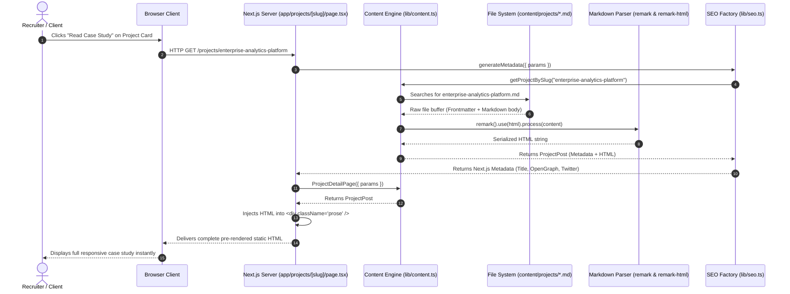
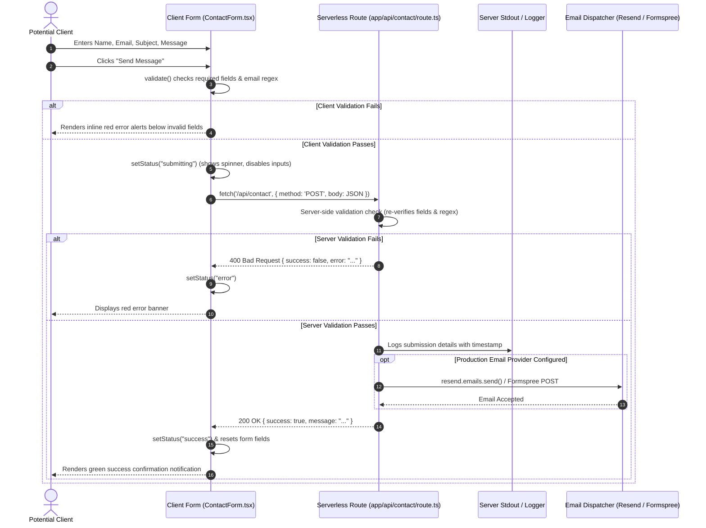
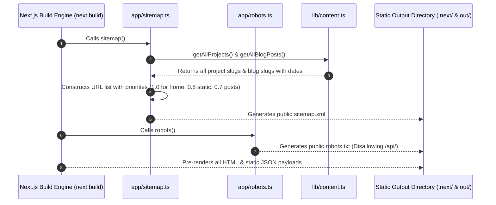

# 05 — Data Flow & State Lifecycle

## 1. Data Flow Overview

Data in this application moves through two distinct modes of execution:
1. **Build-Time / Server-Side Pre-Rendering (SSG/SSR)**: High-speed reading of local Markdown files and TypeScript static arrays to compile static HTML pages prior to client arrival.
2. **Client-Side Interactive Lifecycle**: Real-time user input capture, form validation, asynchronous HTTP dispatch, and local React component state updates.

Below are detailed step-by-step traces and Mermaid sequence diagrams for the three primary flows in the system, followed by an analysis of how state is managed across components.

---

## 2. Flow 1: Case Study Retrieval & Rendering (`/projects/[slug]`)

When a visitor navigates to a project case study (e.g. `/projects/enterprise-analytics-platform`), the Next.js App Router executes the following sequence:



### Step-by-Step Trace

1. **Route Resolution**: The Next.js App Router matches the dynamic segment `[slug]` to `"enterprise-analytics-platform"`.
2. **Metadata Generation**: The server calls [`generateMetadata()`](file:///c:/Users/Adqura1/OneDrive%20-%20Adqura/Desktop/MyPortfolio/app/projects/[slug]/page.tsx#L24-L34), querying [`getProjectBySlug()`](file:///c:/Users/Adqura1/OneDrive%20-%20Adqura/Desktop/MyPortfolio/lib/content.ts#L83-L122).
3. **File Discovery**: `lib/content.ts` searches [`content/projects/`](file:///c:/Users/Adqura1/OneDrive%20-%20Adqura/Desktop/MyPortfolio/content/projects) for `enterprise-analytics-platform.md` or `.mdx`. If not found, `notFound()` triggers the 404 handler.
4. **Frontmatter & Markdown Compilation**:
   - `gray-matter` splits the YAML header into typed JavaScript object attributes (`title`, `techTags`, `role`, etc.).
   - `remark` with `remark-html` compiles the raw Markdown body into an HTML string.
5. **Page Assembly**: [`ProjectDetailPage`](file:///c:/Users/Adqura1/OneDrive%20-%20Adqura/Desktop/MyPortfolio/app/projects/[slug]/page.tsx#L36-L172) embeds the compiled HTML inside `<div className="prose prose-slate max-w-none" dangerouslySetInnerHTML={{ __html: contentHtml }} />` alongside the project stats header and technology badges.
6. **Delivery**: The browser receives fully rendered HTML with zero client-side layout shift.

---

## 3. Flow 2: Contact Form Submission (`POST /api/contact`)

When a user submits a project inquiry via the contact page ([`app/contact/page.tsx`](file:///c:/Users/Adqura1/OneDrive%20-%20Adqura/Desktop/MyPortfolio/app/contact/page.tsx)), data flows through a client-side validation barrier to an isolated serverless API handler.



### Step-by-Step Trace

1. **Input Capture**: As the visitor types, [`handleChange`](file:///c:/Users/Adqura1/OneDrive%20-%20Adqura/Desktop/MyPortfolio/components/sections/ContactForm.tsx#L60-L70) updates the `formData` state object and immediately clears any existing field-level error.
2. **Client Validation**: On submission, [`validate()`](file:///c:/Users/Adqura1/OneDrive%20-%20Adqura/Desktop/MyPortfolio/components/sections/ContactForm.tsx#L33-L58) verifies:
   - `name.trim()` is non-empty.
   - `email.trim()` satisfies `/^[^\s@]+@[^\s@]+\.[^\s@]+$/`.
   - `subject.trim()` is non-empty.
   - `message.trim().length >= 15`.
3. **Pending UI State**: If valid, `status` transitions to `"submitting"`, replacing the Send button icon with `<Loader2 className="animate-spin" />` and disabling all input elements to prevent duplicate clicks.
4. **Serverless HTTP POST**: The payload is serialized as JSON and dispatched to `/api/contact`.
5. **Server Defense & Logging**: [`app/api/contact/route.ts`](file:///c:/Users/Adqura1/OneDrive%20-%20Adqura/Desktop/MyPortfolio/app/api/contact/route.ts#L9-L33) re-evaluates all fields. If valid, it writes the formatted submission to server logs:
   ```
   [Portfolio Contact Form Submission Received]
   Timestamp: 2026-09-16T16:27:09.000Z
   From: Jane Doe <jane@company.com>
   Subject: Senior Engineering Contract
   Message: We would like to discuss an upcoming architecture review...
   ```
6. **Completion**: The route returns `{ success: true }`. The client clears the form inputs and displays a prominent green confirmation alert.

---

## 4. Flow 3: Build-Time Dynamic Sitemap & Route Generation

During `npm run build`, Next.js maps all content to static endpoints:



---

## 5. State Management Architecture

Because this is a content-driven architectural portfolio, global state libraries (like Redux, Zustand, or MobX) are deliberately avoided to eliminate bundle overhead. State is maintained locally where needed:

### State Matrix

| Component | State Variables | State Type | Purpose |
|---|---|---|---|
| [`Navbar.tsx`](file:///c:/Users/Adqura1/OneDrive%20-%20Adqura/Desktop/MyPortfolio/components/layout/Navbar.tsx) | `isOpen` | `boolean` | Controls mobile dropdown drawer visibility. |
| [`Navbar.tsx`](file:///c:/Users/Adqura1/OneDrive%20-%20Adqura/Desktop/MyPortfolio/components/layout/Navbar.tsx) | `scrolled` | `boolean` | Tracks whether `window.scrollY > 20` to toggle the blur/shadow background. |
| [`ContactForm.tsx`](file:///c:/Users/Adqura1/OneDrive%20-%20Adqura/Desktop/MyPortfolio/components/sections/ContactForm.tsx) | `formData` | `FormState` | Controlled inputs for `name`, `email`, `subject`, `message`. |
| [`ContactForm.tsx`](file:///c:/Users/Adqura1/OneDrive%20-%20Adqura/Desktop/MyPortfolio/components/sections/ContactForm.tsx) | `errors` | `FormErrors` | Map of active field validation error messages. |
| [`ContactForm.tsx`](file:///c:/Users/Adqura1/OneDrive%20-%20Adqura/Desktop/MyPortfolio/components/sections/ContactForm.tsx) | `status` | `"idle" \| "submitting" \| "success" \| "error"` | State machine controlling form interactivity and notification banners. |
| [`ContactForm.tsx`](file:///c:/Users/Adqura1/OneDrive%20-%20Adqura/Desktop/MyPortfolio/components/sections/ContactForm.tsx) | `responseMessage` | `string` | Human-readable response message from `/api/contact`. |
